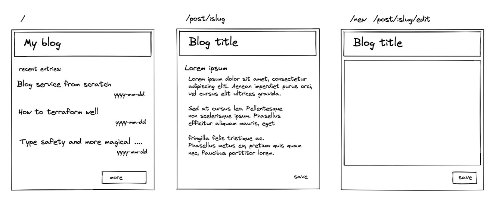
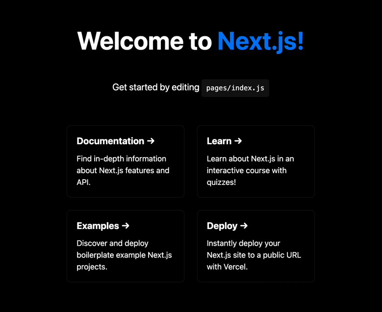
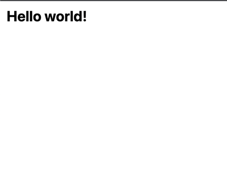
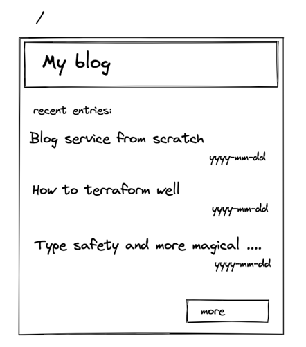
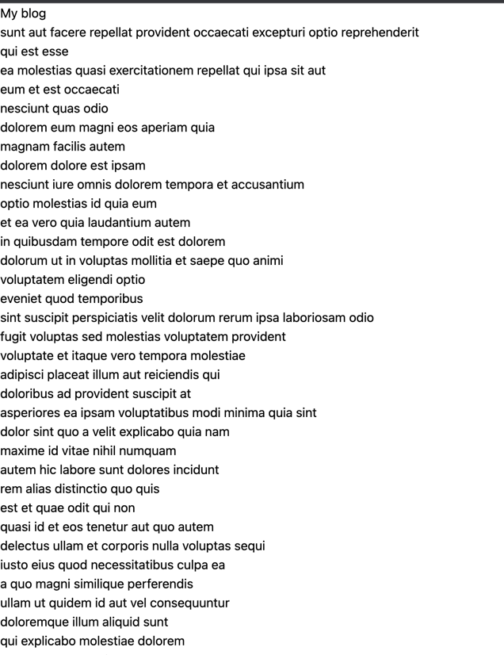
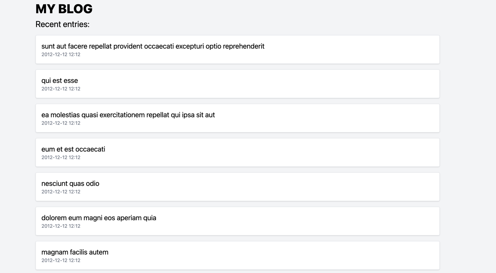
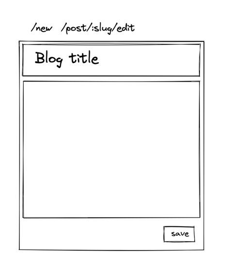
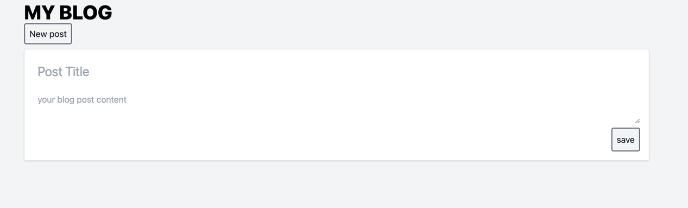

# First iteration: Minimum ~~Viable~~ Deployable Product

For hobby project, I like to define Minimum Deployable Product. 
It should be something that is easy to produce, and easy to deploy.

It's a starting point, and it's not a final product. For MDP I don't care about
the quality of the code, I don't care about the quality of the product, I don't
care about the quality of the documentation. I just want to have something that
I can deploy and show to the world.

MDP should focus on the most important features, and do not do anything else.

## MDP for this book

For this book, I want to have a simple web application that will allow me to
write blog posts. 

Functional requirements for blog site are:
1. User can write a blog post
2. User can see a list of blog posts
3. User can see a blog post    

All blog post are stored in a database. The body of blog is just a plain text.
There is no authorization.

But there are some project requirements:
1. All infrastructure should be defined as code

There will be more functional and project requirements in the future, but for now 
this is enough. We should try to not change these requirements in the future.

## Choosing a technology

For frontend, I will use [React](https://reactjs.org/). There is lots of other viable choices like:
 - [Vue](https://vuejs.org/)
 - [Svelte](https://svelte.dev/)
 - [Ember](https://emberjs.com/)
 - [Preact](https://preactjs.com/)

 React is the most popular framework, and currently every frontend developer should know it.

For backend, I want to limit my choices to frameworks that require typescript. 
There is lots of good options in different languages like for example:
 - [FastAPI](https://fastapi.tiangolo.com/) (Python)
 - [Django](https://www.djangoproject.com/) (Python)
 - [Flask](https://flask.palletsprojects.com/en/1.1.x/) (Python)
 - [Spring](https://spring.io/) (Java)
 - [Rocket](https://rocket.rs/) (Rust)
 - [Gin](https://gin-gonic.com/) (Go)
 - [Echo](https://echo.labstack.com/) (Go)
 - [Phoenix](https://www.phoenixframework.org/) (Elixir)

Having backend in different language, can be a good idea,
when there is good separation between frontend and backend.

But for single man project, having everything in one language and one codebase make sense.

Modern choices for writing TypeScript backend:
 - [Remix](https://remix.run/)
 - [Next.js](https://nextjs.org/)
 - [Fresh](https://fresh.deno.dev/)

Deno is a new runtime for TypeScript, and it does good job to push node in correct direction.
I don't think that Deno is ready for production, but it's a good idea to keep an eye on it.
Because of it there is slow movement in node community with projects like [Bun](https://bun.sh/)
making TypeScript and JavaScript development more pleasant.
The choice between Remix and Next.js is not easy. Remix is a new framework, 
and because of that it might change a lot in near future. Choosing Next.js is more safe bet.

## Bootstraping the project

Starting [Next.js](https://nextjs.org/) project is easy. Just run:

```bash
npx create-next-app@latest --typescript
```

This will create a new project, the result after this command you can find in: [this repo](https://github.com/dswistowski/completestack-blog/tree/chatpter-01-fetch-and-render-posts)

> **_TODO:_** Put small chapter about how to use `Next.JS`


> **_Alternatives:_**  It's possible to create next.js project with [create-t3-app](https://create.t3.gg/)
> I'd use it form most of my bootstraping projects, but for this book I want to go step by step.

You can start development server with:

```bash
npm run dev
```

After pointing browser to [http://localhost:3000](http://localhost:3000) you should see:




## Initial configuration

Starting structure is fine for small hacking, but it's easier to maintain it, if all compiled files are in src directory. 
To archieve it you can run the command:

```bash
mkdir src
mv pages src
mv styles src
```

Lets make our index page blank, remove Home module styles:

```bash
rm src/styles/Home.module.css
```

and make `src/styles/globals.css` empty.

And then remove line: 
```typescript
import '../styles/globals.css'
```
from `src/pages/_app.tsx`
and replace `src/pages/index.tsx` with:

```typescript tsx
import type { NextPage } from 'next'

const Home: NextPage = () => {
  return (
    <h1>Hello world</h1>
  )
}

export default Home
```

## Styles

I like to use [tailwind](https://tailwindcss.com/) for styling. It's easy to use, and it's easy to customize.
Tailwind is utility first css framework allowing you to rapidly build custom designs without ever leaving your HTML.
The other popular option is [chakra](https://chakra-ui.com/), [styled-components](https://styled-components.com/),
[emotion](https://emotion.sh/docs/introduction) or [stitches](https://stitches.dev/).

Some developers prefer to use css is js approach, but I think it's adds to much boilerplate code. 

To add tailwind to the project, you can run:

```bash
npm install -D tailwindcss@latest postcss@latest autoprefixer@latest
npx tailwindcss init -p
```
This commands will istall tailwind, postcss and autoprefixer, and create `tailwind.config.js` and `postcss.config.js` files.

Then you can add tailwind to `src/styles/globals.css` file:

```css
@tailwind base;
@tailwind components;
@tailwind utilities;
```

Last step is to update `tailwind.config.js` file, configure content option with paths of all our future pages and components:

```javascript
/** @type {import('tailwindcss').Config} */
module.exports = {
  content: [
      "./src/pages/**/*.{js,ts,jsx,tsx}",
      "./src/components/**/*.{js,ts,jsx,tsx}",
  ],
  // ...
}
```

so tailwind will remove unused styles from production build.

finally we can update `src/pages/index.tsx` to use tailwind:

```typescript tsx
import type { NextPage } from "next";

const Home: NextPage = () => {
  return <h1 className="text-4xl font-bold p-4">Hello world!</h1>;
};

export default Home;
```

On this point, you can run `npm run dev` and see the result:




It's time to commit code to git, and [push it to github](https://github.com/dswistowski/completestack-blog/tree/chapter-01-add-tailwind).

# Index page

The next step is to create index page, that will list all posts. We do not configure any backend yet, so we will use 
[JSONPlaceholder](https://jsonplaceholder.typicode.com/) as a fake backend.
The expected result if this step to have index page rendered:
.

To achieve that we need to add `useQuety` hook from [react-query](https://react-query.tanstack.com/).
This hook will allow us to fetch data from backend, and cache it in the browser.

```bash
npm install @tanstack/react-query --save
```

In order to be able to use `useQuery` hook, we need to wrap our app with `QueryClientProvider` (file `src/pages/_app.tsx`):

```typescript jsx
import type { AppProps } from "next/app";
import "../styles/globals.css";
import { QueryClient, QueryClientProvider } from "@tanstack/react-query";
const queryClient = new QueryClient();

function MyApp({ Component, pageProps }: AppProps) {
  return (
    <QueryClientProvider client={queryClient}>
      <Component {...pageProps} />
    </QueryClientProvider>
  );
}
export default MyApp;
```

`QueryClientProvider` will put `queryClient` in React context, so we can use it in any component.

So now in our `src/pages/index.tsx` file we can use `useQuery` hook:

```typescript jsx
// ..
const Home: NextPage = () => {
    const posts = useQuery(["posts"], fetchPosts);
    // ...
}
```

and we can define `fetchPosts` function:

```typescript jsx
type Post = {
    userId: number;
    id: number;
    title: string;
    body: string
}

const fetchPosts = async () => {
    const res = await fetch("https://jsonplaceholder.typicode.com/posts");
    return await res.json() as Post[];
}
```

Now we can use `posts` data in our component:

```typescript jsx
const Home: NextPage = () => {
  const posts = useQuery(["posts"], fetchPosts);
  if (posts.isLoading) return <div>Loading...</div>;
  if (posts.isError) return <div>Error</div>;
  return (
    <>
      <header>
        <h1>My blog</h1>
      </header>
      <main>
        <ul>
          {posts.data.map((post) => (
            <li key={post.id}>{post.title}</li>
          ))}
        </ul>
      </main>
    </>
  );
};

export default Home;
```

```if (posts.isLoading) return <div>Loading...</div>;``` is early exit from the component, if data is not yet loaded.

```if (posts.isError) return <div>Error</div>;``` is early exit from the component, if there was an error while fetching data.

if data is loaded, we can render it in the list with:
```typescript jsx
{posts.data.map((post) => (
    <li key={post.id}>{post.title}</li>
))}
```

### Why useQuery hook?

For simple use cases you can use `fetch` function directly, but `useQuery` gives you abstraction over fetching data, and it's caching.
Without `useQuery` you would need to implement own fetching logig. It would be something like this:

```typescript jsx
const usePosts = () => {
    const [posts, setPosts] = useState<Post[]>([]);
    const [isLoading, setIsLoading] = useState(false);
    const [isError, setIsError] = useState(false);
    
    useEffect(() => {
        let isMounted = true;
        setIsLoading(true);
        fetchPosts()
            .then((posts) => isMounted && setPosts(posts))
            .catch(() => isMounted && setIsError(true))
            .finally(() => isMounted && setIsLoading(false));
        return () => {
            isMounted = false;
        }
    }, []);
    
    return { posts, isLoading, isError };
}
```
This code covers only fetching data, without caching. 


On this point, you can run `npm run dev` and see the result:



It's time to commit code to git, and [push it to GitHub](https://github.com/dswistowski/completestack-blog/tree/chatpter-01-fetch-and-render-posts).

## Styling index page

Now we can add some styling to our index page. We will use tailwind to style it.
Tailwind provides utility classes that can be used to style components.
In order to use them, we need to add `className` attribute to our elements. Lets wrap our index with `div`:

```typescript jsx
<div className="mx-auto max-w-6xl">
    ...
</div
```
This is a container that will center our content (because `m(argin)x-auto`), and limit it's width to 6xl breakpoint (`max-w(idth)-6xl`).

After thad add some spacing to header:

```typescript jsx
<header className="py-2">
    <h1 className="text-4xl font-extrabold uppercase">My blog</h1>
</header>
```

Header will have `y` axis padding of 2 units (`py-2`), and title will have font size of 4xl (`text-4xl`), and will be bold (`font-extrabold`).


and to main section:

```typescript jsx
<h2 className="text-2xl">Recent entries:</h2>
<ul className="mt-4">
  {posts.data.map((post) => (
    <li key={post.id} className="flex flex-col my-4">
      <h3 className="text-xl">{post.title}</h3>
      <span className="text-sm text-gray-500">2012-12-12 12:12</span>
    </li>
  ))}
</ul>
```

Subheader will have font size of 2xl (`text-2xl`), and list will have margin top of 4 units (`mt-4`).
Inside list we will have flex column layout (`flex flex-col`), and margin bottom of 4 units (`my-4`).

> Note: Flex layout shine in managing layout of intrinsic size children, and you can read more about it [here](https://css-tricks.com/snippets/css/a-guide-to-flexbox/).

After having this code, we can pimp up our index page, by adding cards to our list: `bg-white rounded border shadow`:

```typescript jsx
<li
  key={post.id}
  className="p-4 my-4 flex flex-col bg-white rounded border shadow"
>
  <h3 className="text-xl">{post.title}</h3>
  <span className="text-sm text-gray-500">2012-12-12 12:12</span>
</li>
```

And last step is to make our cards more visible, by changing background color of body to `bg-gray-100`. 
To do that we can use `@apply` directive, that will apply all classes from `bg-gray-100` to `body` element in our `styles/globals.css`:

```css

body {
    @apply bg-gray-100;
}
```

After this, our index page should look like this: 


Lets commit our changes to git, and [push it to GitHub](https://github.com/dswistowski/completestack-blog/tree/chatpter-01-after-styling-index).

## New post page

After styling index page, we can move to creating new post page. 


For easy navigation lets start from adding link on index page to new post page:

```typescript jsx
<nav>
  <ul className="flex gap-2 mt-2">
    <li>
      <Link href="/new" passHref>
        <a className="p-2 rounded border-2 border-gray-500 text-gray-900 bg-gray-100 hover:bg-gray-700 hover:text-gray-100">
          New post
        </a>
      </Link>
    </li>
  </ul>
</nav>
```

> **_Note:_**  Next.js's `Link` component is used to navigate between pages. `passHref` is used to tell `Link` to pass `href` attribute to child element. In this case it's `a` element. 
> Without this, the &lt;a&gt; tag will not have the href attribute, which hurts your site's accessibility and might affect SEO.


After that we can create `src/pages/new.tsx` file, and add some content to it:

```typescript jsx
import { NextPage } from "next";

const New: NextPage = () => {
  return <div>New page placeholder</div>;
};

export default New;
```

After this change the button we added should redirect to new page.

### Extracting components

There are two elements shared between index and new post page: header and layout. 
Now it's good time to extract them to components.
Lets start with layout, by creating `src/components/layout.tsx` file, and adding following content to it:

```typescript jsx
import React, { PropsWithChildren } from "react";

export const Layout: React.FC<PropsWithChildren> = ({ children }) => (
    <div className="mx-auto max-w-6xl">{children}</div>
);
```

The type definition for this component is `React.FC<PropsWithChildren>`, which means that it's a functional component, 
that accepts props, and has children.
It's time to use it on our index page:

```typescript jsx
// ..
import { Layout } from "../components/layout";
// ..
const Home: NextPage = () => {
    const posts = useQuery(["posts"], fetchPosts);
    if (posts.isLoading) return <div>Loading...</div>;
    if (posts.isError) return <div>Error</div>;
    return (
        <Layout>
            // ..
        </Layout>
    );
}
```

and new:

```typescript jsx
import { NextPage } from "next";
import { Layout } from "../components/layout";

const New: NextPage = () => {
  return <Layout>New</Layout>;
};

export default New;
```

After this change, we should do the same with the header in `src/components/header.tsx`:

```typescript jsx
import Link from "next/link";
import React from "react";

export const Header: React.FC = () => (
  <header className="py-2">
    // content copied from index page
  </header>
);
```

Update index page:

```typescript jsx
const Home: NextPage = () => {
    // ..
    return (
        <Layout>
            <Header/>
            <main>
                // ..
            </main>
        </Layout>
    )
}
```

And new post page:

```typescript jsx
import { NextPage } from "next";
import { Layout } from "../components/layout";
import { Header } from "../components/header";

const New: NextPage = () => {
  return (
    <Layout>
      <Header />
      New
    </Layout>
  );
};

export default New;
```

Now lets create the form:

```typescript jsx
import { NextPage } from "next";
import { Layout } from "../components/layout";
import { Header } from "../components/header";

const New: NextPage = () => {
  return (
    <Layout>
      <Header />
      <main className="py-2">
        <form className="p-4 bg-white rounded border shadow flex flex-col gap-2">
          <input
            className="p-2 text-2xl w-full"
            type="text"
            placeholder="Post Title"
          />
          <textarea
            className="p-2 text-md"
            placeholder="your blog post content"
          ></textarea>
          <button className="p-2 rounded border-2 border-gray-500 text-gray-900 bg-gray-100 hover:bg-gray-700 hover:text-gray-100 w-fit self-end">
            Save
          </button>
        </form>
      </main>
    </Layout>
  );
};

export default New;
```

At this point we introduced some duplications, which we can fix by extracting `Card` and `Button` component.
Lets start with `Button`. It's present in two places: header and the form but in header it's an `anchor` element, 
but in form it's a `button` element.
To make it reusable we can use `as` prop, that will allow us to change the element type (new file `src/components/button.tsx`):

```typescript jsx
import React from "react";

export const Button: React.FC<{
    as?: "button" | "a";
    children: string;
    className?: string;
}> = ({ children, as = "button", className = "", ...props }) => {
    return React.createElement(
        as,
        {
            className: `p-2 rounded border-2 border-gray-500 text-gray-900 bg-gray-100 hover:bg-gray-700 hover:text-gray-100 ${className}`,
            ...props,
        },
        children
    );
};
```

We are using `React.createElement` to create element based on `as` prop. 
We are also passing all props to the new element, 
but there is no type definition for additional props so it will be not possible to use them at the moment.
We will solve that problem when we will need add additional props to the button.

We can now use our button in the form:

```typescript jsx
// ...
<textarea
    className="p-2 text-md"
    placeholder="your blog post content"
></textarea>
<Button className="self-end">save</Button>
// ...
```

and in the header:

```typescript jsx
// ..
<Link href="/new" passHref>
    <Button as="a">New post</Button>
</Link>
// ..
```

After last change you you will see errors in the console:

> Warning: Functions are not valid as a React child. This may happen if you return a Component instead of <Component /> from render. Or maybe you meant to call this function rather than return it.

It's because we are using function component as a child of `<Link>` element with `passHref`. To fix it we can use `React.forwardRef`:

```typescript jsx
import React from "react";

export const Button: React.FC<{
    as?: "button" | "a";
    children: string;
    className?: string;
}> = React.forwardRef(function InnerButton(
    { children, as = "button", className = "", ...props },
    ref
) {
    return React.createElement(
        as,
        {
            className: `p-2 rounded border-2 border-gray-500 text-gray-900 bg-gray-100 hover:bg-gray-700 hover:text-gray-100 ${className}`,
            ref,
            ...props,
        },
        children
    );
});
```

Forward ref will be used by `Link` component to get access to the `a` element, even if it's wrapped by `Button` component.

It's time to commit to git, and push: , and [push it to github](https://github.com/dswistowski/completestack-blog/tree/chapter-01-new-post-page).

Our current page looks like:



## New post form, cleaning up

There is few things that we can improve:

1. Header spacing look odd around button
2. We cannot go back to list of posts
3. New post button is active on `/new` page
4. On small screen, the form touch end of the screen without any padding
5. Post editor should fill whole screen and the blog post field should use as much space as it's possible


### Fixing spacing
Lets do it now, fixing spacing in header is easy, lets change margins of nav ul element from `m(argin )t(op)-2` to `m(margin )y(-axis)-4` 
in `src/components/header.tsx` file:

```typescript jsx
// ,,,
<nav>
  <ul className="flex gap-2 my-4">
  // ...
  </ul>
</nav>
// ,,,
```

### Adding home link to page title
To fix the second issue we can add link to `/` to the header by replacing
```typescript jsx
<h1 className="text-4xl font-extrabold uppercase">My blog</h1>
```
with
```typescript jsx
<Link href="/">
  <a>
    <h1 className="text-4xl font-extrabold uppercase inline-flex">
      My blog
    </h1>
  </a>
</Link>
```

New `inline-flex` class will set display type for our title to `inline-flex` as a result the title will not have full page width.

### Deactivate new post button

Links with extra styling for active pages are common pattern in web applications. 
We can create new `LinkButton` component that will be used in header by extracting current `/new` page button:

To acheive that in file `src/components/header.tsx` we can replace:

```typescript jsx
import { Button } from "./button";
// ...
<Link href="/new" passHref>
    <Button as="a">New post</Button>
</Link>
```

with:

```typescript jsx
import { LinkButton } from "./button";
// ...
<LinkButton href="/new">New post</LinkButton>
```

And create new `LinkButton` component in `src/components/button`:

```typescript jsx
import { useRouter } from "next/router";
// ...
export const LinkButton: React.FC<{
  children: string;
  href: string;
}> = ({ children, href }) => {
  const route = useRouter();

  return (
    <Link href={href} passHref>
      <Button
        className={route.asPath === href ? "bg-gray-700 text-gray-100" : ""}
      >
        {children}
      </Button>
    </Link>
  );
};
```

Hook `useRouter` will give us access to current route, and we can use it to check if current route is the same as `href` prop.
If it's the same, we will apply additional styling to the button.

### Fixing small screen problem

To fix small screen problem we can add padding to the form by adding `p-4` class to our `Layout` component in `src/components/layout.tsx` file:

```typescript jsx
export const Layout: React.FC<PropsWithChildren> = ({ children }) => (
  <div className="mx-auto max-w-6xl px-4">{children}</div>
);
```

### Making new post form to fill whole screen


